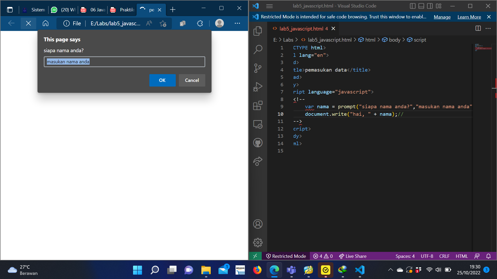
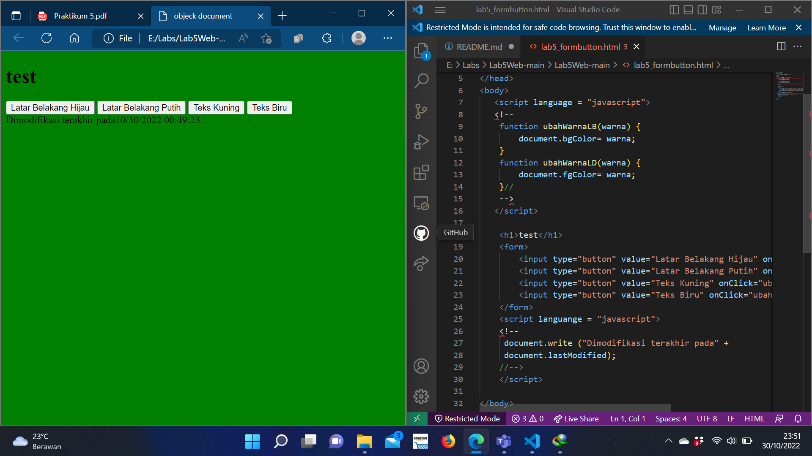

# Lab5Web
### Pengenalan JavaScript
Langkah pertama pada praktikum ini adalah pengenalan JavaScript. contoh syntax sederhana :

### Pemakaian Alert 
Langkah berikutnya adalah membuat alert box sebagai property window.

### Pemakaian method dalam objek
Langkah berikutnya adalah pemakaian method dalam object.

### Pemakaian Prompt 
Langkah berikutnya adalah pemakaian Prompt.

### Pembuatan Fungsi dan cara pemanggilanya
Langkah berikutnya adalah pembuatan fungsi.

## Dasar Pemrograman Di JavaScript

### Operasi dasar aritmatika
Langkah berikutnya adalah pengenalan dasar pemrograman di javascript, berikut kode operasi dasar aritmatika dan hasilnya :

### Seleksi kondisi (if.else)
Langkah berikutnya dalam pemrograman dasara javascript adalah seleksi kondisi atau if.else, berikut kode dan hasilnya :

### Penggunaan operator switch untuk seleksi method
Langkah berikutnya adalah penggunaan operator switch untuk seleksi method, berikut kode dan hasilnya :

## Pembuatan Form
### Pembuatan Form Input
Langkah berikutnya adalah pembuatan form input, berikut kode dan hasilnya :

### Pembuatan Form Button
Langkah berikutnya adalah pembuatan form button, berikut kode dan hasilnya :

### HTML DOM
Pilihan menggunakan checkBox dengan perhitungan otomatis
